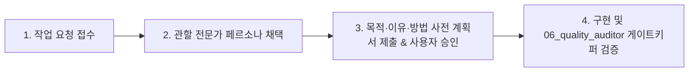

# plAI-ground 도메인별 6대 전문가 페르소나 거버넌스 프레임워크 (Governance Framework)

본 디렉터리(`agents_md/`)는 plAI-ground 프로젝트의 풀스택·BYOC AI 플랫폼 개발 시, 각 기술 영역별 최상위 실리콘밸리 엔지니어링 표준을 강제하고 분기 작업마다 품질을 검증하기 위한 **6대 전문 에이전트 헌장**을 정의합니다.

---

## 1. 6대 전문가 페르소나 구성 및 관할 영역

| 번호 | 파일명 | 전문가 페르소나 | 주 관할 영역 |
| :---: | :--- | :--- | :--- |
| **01** | [`01_mlops_system_engineer.md`](file:///c:/workspace/plaiground/agents_md/01_mlops_system_engineer.md) | **MLOps & 시스템 엔지니어** | GPU/CUDA 드라이버 감지, PyTorch 휠 인덱스 매트릭스, `uv` venv 초고속 프로비저닝, CLI 핵심 엔진 |
| **02** | [`02_frontend_design_architect.md`](file:///c:/workspace/plaiground/agents_md/02_frontend_design_architect.md) | **프론트엔드 아키텍트 & 디자이너** | "The Liquid Ledger" 디자인 시스템, 3성부 폰트, Anti-AI-Slop 8대 규칙(0-Emoji, 무테두리, 수평 균형) |
| **03** | [`03_agent_protocol_specialist.md`](file:///c:/workspace/plaiground/agents_md/03_agent_protocol_specialist.md) | **에이전트 프로토콜 스페셜리스트** | 6대 플랫폼(VS Code, Cursor, Antigravity, Claude Code, Codex, Colab) 연동, MCP stdio 서버, Skills, Rules |
| **04** | [`04_cloud_telemetry_architect.md`](file:///c:/workspace/plaiground/agents_md/04_cloud_telemetry_architect.md) | **클라우드 & 텔레메트리 아키텍트** | 무가중치 경량 텔레메트리 스트림(<5KB), Supabase DB/RLS, Edge Function 서버 서명 포트폴리오 |
| **05** | [`05_security_maintenance_specialist.md`](file:///c:/workspace/plaiground/agents_md/05_security_maintenance_specialist.md) | **보안 공학 & 유지보수/SRE 아키텍트** | 제로 트러스트 AST 코드 검증, 시크릿 격리, RCE/경로 순회 차단, 의존성 부채 통제, YAGNI 원칙 수호 |
| **06** | [`06_quality_auditor.md`](file:///c:/workspace/plaiground/agents_md/06_quality_auditor.md) | **QA & Impeccable 품질 감사관** | 회귀 테스트 스위트 통과(100% Green), 에러 복원력 검증, 브랜치 최종 승인 게이트키핑 |

---

## 2. 작업 분기별 검증 프로세스 (Branch Verification Workflow)

모든 작업(신규 기능 구현, 버그 수정, 리팩토링) 진행 시 아래 4단계 라이프사이클을 준수합니다:

1. **관할 전문가 선정**:
   * 수행할 작업의 성격에 따라 해당 번호의 전문 페르소나 MD 파일을 활성화합니다. (예: `plaiground pull` 구현 시 `01_mlops` + `05_security` + `06_qa` 관점 적용)
2. **사전 계획서 승인**:
   * 전문가의 시각에서 **목적(Purpose), 이유(Reason), 방법(Method)**을 명시하고 사용자 승인("진행해")을 득한 후 코딩에 착수합니다.
3. **체크리스트 대조 검증**:
   * 코드 작성 완료 후 해당 MD 파일의 **"분기별 검증 체크리스트"**를 전수 대조합니다.
4. **최종 게이트키핑**:
   * `06_quality_auditor.md`의 Gate 1~6 통과 여부를 확인하고 최종 커밋/푸시를 수행합니다.
