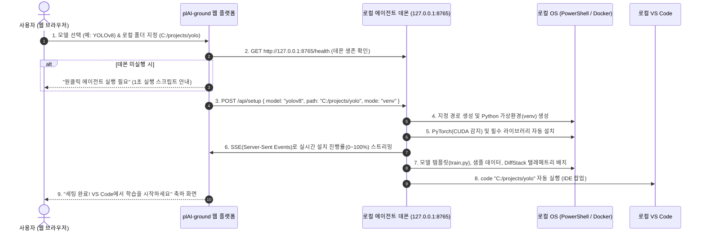

# plAI-ground 멀티 환경 원클릭 세팅 기술 전략 보고서
> **문서 번호:** PLAI-TECH-2026-002  
> **최종 개정일:** 2026년 10월  
> **핵심 주제:** 제로 인프라 연동, 웹-로컬 브릿지(Web-to-Local Bridge) 원클릭 디렉토리 세팅, CLI 및 Google Colab 1줄 연동, 계정 연동 및 무결성 텔레메트리

---

## 1. 기술적 개요: 브라우저 보안 한계와 웹-로컬 연동의 실현 가능성

### 1.1 사용자의 핵심 질문에 대한 직접적 기술 답변
> **"웹 페이지에서 똑같이 AI 모델을 선택하고 자신의 로컬 컴퓨터 작업 디렉토리 폴더를 설정하면, 그 로컬 디렉토리 폴더에 가상환경 설치와 도커 컨테이너 설치, AI 모델 설치, 예시 학습 코드 및 데이터 설치를 해주는 것이 기술적으로 가능한 작업인가?"**

👉 **결론부터 말씀드리면, 100% 가능하며 이미 글로벌 선도 IT 기업들(Docker, Ollama, 1Password, GitHub Desktop 등)이 표준으로 사용하고 있는 검증된 아키텍처입니다.**

### 1.2 웹 브라우저 샌드박스의 보안 제약과 해결책
- **브라우저의 보안 한계 (Same-Origin Policy & Sandbox)**:
  - 순수 웹 브라우저의 JavaScript(Chrome, Edge 등)는 악성 웹사이트가 사용자의 컴퓨터 하드디스크를 임의로 포맷하거나 악성 스크립트를 실행하는 것을 막기 위해, 로컬 OS 프로세스(`powershell.exe`, `docker run`, `python -m venv`)를 직접 실행할 수 있는 권한이 차단되어 있습니다.
- **업계 표준 해결책: 로컬 에이전트 데몬 (Local Agent Daemon) 또는 네이티브 브릿지**:
  - 사용자의 로컬 PC에서 가볍게 동작하는 **백그라운드 에이전트(`plaiground-daemon`)**가 로컬 포트(`127.0.0.1:8765`)를 열고 대기합니다.
  - 사용자가 plAI-ground 웹사이트에서 [폴더 선택] 및 [모델 선택] 후 [원클릭 세팅 시작]을 누르면, 웹 브라우저가 로컬 에이전트에게 HTTP/WebSocket 요청을 전송합니다.
  - 로컬 에이전트가 사용자의 컴퓨터 권한으로 해당 디렉토리에 가상환경 생성, 도커 빌드, 코드 및 데이터셋 배치를 완벽하게 수행하고 VS Code를 띄워줍니다.

---

## 2. 3가지 원클릭 세팅 구현 전략 비교

```
┌─────────────────────────────────────────────────────────────────────────────┐
│                       plAI-ground 세팅 전략 트리                            │
└─────────────────────────────────────────────────────────────────────────────┘
                                  │
         ┌────────────────────────┼────────────────────────┐
         ▼                        ▼                        ▼
[방식 1: 개발자용 CLI]     [방식 2: 무료 코랩 1줄]    [방식 3: 웹-로컬 브릿지]
 - pip install plaiground  - !pip install plaiground  - 웹 UI에서 폴더 클릭
 - plaiground init         - pg.load_template()       - 로컬 데몬이 venv/도커 구축
 - 전공자/터미널 친화형    - 저사양/비전공자/GPU 0원  - 컴맹/초심자/UI 극대화
```

| 비교 항목 | 방식 1. CLI 터미널 도구 | 방식 2. 구글 코랩 1줄 연동 | 방식 3. 웹-로컬 브릿지 (웹 UI 클릭) |
| :--- | :--- | :--- | :--- |
| **대상 사용자** | 컴퓨터공학 전공생, 현업 엔지니어 | 저사양 노트북 소유자, GPU 없는 학생 | 1학년 학부생, 비전공자 국비 부트캠프생 |
| **실행 방식** | `plaiground init resnet` | `!pip install plaiground` | 웹 페이지에서 마우스 클릭으로 폴더/모델 지정 |
| **컴퓨팅 자원** | 사용자 로컬 PC (NVIDIA / Apple Silicon) | 구글 무료 T4/L4 GPU (Google 자원 레버리지) | 사용자 로컬 PC (venv 또는 Docker) |
| **설치 소요 시간** | 30초 내외 | 10초 내외 | 1~2분 (로컬 패키지 설치 진행률 UI 표시) |
| **스타트업 인프라 비용**| **0원** (순수 로컬 연산) | **0원** (Google 자원 흡수) | **0원** (순수 로컬 연산) |

---

## 3. 세부 방식별 아키텍처 및 구현 명세

### 3.1 방식 3 (사용자 요청 핵심): 웹-로컬 브릿지 (Web-to-Local Bridge)
웹 화면에서 모델과 로컬 작업 폴더를 선택하면, 로컬 PC의 해당 폴더에 가상환경, 도커, 모델, 코드, 데이터가 마법처럼 세팅되는 방식입니다.

#### 3.1.1 동작 흐름도 (End-to-End Workflow)


#### 3.1.2 로컬 에이전트 데몬 구현 방안 (이미 구현된 `ai_set_demo` 확장)
대표님이 기존에 만드신 `c:\workspace\plaiground\ai_set_demo\api_server.py`는 이미 로컬 FastAPI 서버로 도커 컨테이너를 제어하는 우수한 코어 로직을 가지고 있습니다. 이를 경량 백그라운드 데몬으로 패키징하면 됩니다:

1. **설치/실행의 간소화**:
   - 윈도우 사용자는 PowerShell 한 줄만 붙여넣으면 백그라운드에 등록됩니다:
     ```powershell
     irm https://plaiground.io/agent.ps1 | iex
     ```
   - 또는 10MB 미만의 단일 실행 파일(`plaiground-agent.exe`)을 다운로드하여 더블 클릭하면 윈도우 트레이 아이콘으로 상주.
2. **로컬 에이전트 API 엔드포인트 명세**:
   - `GET /health`: 에이전트 실행 여부 및 시스템 사양(NVIDIA GPU 유무, VRAM, Python 버전) 반환.
   - `POST /select-folder`: 브라우저 대신 윈도우 네이티브 폴더 탐색기(`tkinter` 또는 Win32 다이얼로그)를 띄워 사용자가 마우스로 폴더를 안전하게 선택하게 함.
   - `POST /setup`:
     - 입력: `{ "target_dir": "C:/ai_study", "model_id": "resnet50", "environment": "venv" | "docker" }`
     - 수행: 폴더 생성 ➔ `python -m venv .venv` ➔ `pip install torch torchvision --index-url https://download.pytorch.org/whl/cu121` (GPU 맞춤) ➔ `train.py` 및 샘플 데이터 복사 ➔ `code <target_dir>` 실행.
   - `GET /setup-progress`: Server-Sent Events(SSE)로 설치 로그 실시간 브라우저 전송.

---

### 3.2 방식 1: 개발자 및 전공자용 표준 CLI (`pip install plaiground`)

터미널에 익숙한 전공생이나 연구원을 위한 가장 깔끔하고 오류 없는 방식입니다.

#### 3.2.1 사용자 명령어 흐름
```bash
# 1. plAI-ground 도구 설치 (최초 1회)
pip install plaiground

# 2. 계정 인증 (브라우저가 열리며 1초 만에 로그인 완료)
plaiground login

# 3. 원하는 모델로 로컬 원클릭 프로젝트 생성
plaiground init resnet-cifar10 --dir ./my_first_ai
```

#### 3.2.2 CLI 내부 자동화 로직
1. **하드웨어 자동 감지**:
   - OS가 Windows, Linux, macOS인지 감지.
   - NVIDIA GPU 및 드라이버 버전(`nvidia-smi`) 확인.
   - CUDA가 없을 경우 자동으로 CPU/MPS 최적화 패키지 선택 (사용자가 "CUDA 버전이 안 맞아요"라는 에러를 겪지 않도록 차단).
2. **가상환경 격리 및 의존성 주입**:
   - 시스템 파이썬 오염을 막기 위해 대상 디렉토리 내 `.venv` 생성.
   - 패키지 종속성 자동 설치.
3. **코드 및 학습 데이터 번들 배치**:
   - `model.py`, `train.py`, `dataset/` 자동 생성.
   - plAI-ground 텔레메트리 래퍼 주입:
     ```python
     # train.py 상단에 자동 포함
     import plaiground as pg
     tracker = pg.init(project="cifar10-resnet")
     
     # 에포크마다 3D 시각화 및 무결성 데이터 전송
     tracker.log(epoch=epoch, loss=loss.item(), acc=acc, weights=model.state_dict())
     ```
4. **IDE 자동 런치**:
   - 로컬에 설치된 VS Code 또는 Cursor를 실행하여 즉시 코딩 가능한 상태로 전환.

---

### 3.3 방식 2: 무료 구글 코랩(Google Colab) 1줄 연동

로컬 PC 사양이 낮거나(GPU 없는 사무용 노트북, 맥북 에어), 도커나 가상환경 설치조차 부담스러운 초심자를 위한 궁극의 연동 방식입니다.

#### 3.3.1 코랩 노트북 셀 구성
```python
# [Cell 1] 원클릭 환경 준비 (Google의 무료 T4 GPU 활용)
!pip install -q plaiground
import plaiground as pg

# 계정 토큰 인증
pg.auth(token="usr_tok_a8f9c102")

# 원하는 실습 템플릿 로드 (코드, 데이터, 시각화 후크 자동 세팅)
pg.load_template("diffusion-mnist")
```

```python
# [Cell 2] 실행 및 학습
# 백그라운드에서 DiffStack이 코드 수정 이력과 에러 해결 로그를 수집
!python train.py
```

#### 3.3.2 실행 후 결과
- 학습 도중 실시간으로 plAI-ground 플랫폼의 ViewAI 3D 시각화 화면으로 그래프와 텐서가 전송됩니다.
- 학습 종료 시 셀 하단에 클릭 가능한 링크 출력:
  > **[plAI-ground 무결성 포트폴리오 생성 완료!]**  
  > 🔗 `https://plaiground.io/p/verify_20261005_cifar10`  
  > *"Google Colab T4 GPU 환경에서 5에포크 완주, 손실값 0.042 달성, 무결성 검증 완료"*

---

## 4. 사용자 계정 연동 및 쿼터(Quota) 제어 아키텍처

CLI, 코랩, 웹-로컬 데몬 어디서 실행하든 사용자의 중앙 웹 계정과 완벽하게 연동됩니다.

```
┌──────────────────────────────────────────────────────────────────┐
│                   plAI-ground Cloud (Supabase)                   │
│  - users (id, email, subscription_tier: free | pro | campus)     │
│  - portfolios (id, user_id, integrity_hash, public_url)          │
│  - usage_credits (user_id, free_credits_remaining: 5 -> 4 -> 0)  │
└──────────────────────────────────┬───────────────────────────────┘
                                   │
                                   ▼
        ┌─────────────────────────────────────────────────────┐
        │                 API Key / JWT 인증                  │
        └──────────────────────────┬──────────────────────────┘
                                   │
          ┌────────────────────────┼────────────────────────┐
          ▼                        ▼                        ▼
    [CLI Agent]            [Google Colab]           [Web Daemon]
```

1. **무료 사용자 (Free Tier)**:
   - 원클릭 세팅: **무제한 무료**.
   - 포트폴리오 생성: **5회 무료 크레딧**.
   - 크레딧 소진 시: 6회차 생성 시도 시 웹/CLI 상에서 *"무료 크레딧 5회를 모두 사용하셨습니다. Pro 플랜(월 9,900원)으로 무제한 포트폴리오를 발행하세요!"* 모달 노출.
2. **대학 학과 / KDT 부트캠프 계정**:
   - 학과 라이선스 키(`CAMPUS_KEY_SNU_AI_2026`) 등록 시 해당 학기 동안 전원 무제한 사용 및 교수 LMS 콘솔로 과제 제출 자동 연동.

---

## 5. 치팅 방지 및 코드 무결성 검증 엔진 (DiffStack)

단순히 남의 코드를 복사해서 돌린 것인지, 학생이 직접 로컬에서 고민하며 에러를 해결했는지를 판별하는 핵심 기술입니다:

1. **타임스탬프 델타(Delta) 분석**:
   - ChatGPT에서 한 번에 500줄을 복사해 넣은 코드 vs 1시간 동안 변수를 바꾸고 하이퍼파라미터를 튜닝하며 점진적으로 작성된 코드의 수정 간격(Keystroke/Save interval) 감정.
2. **런타임 에러 복구 궤적(Traceback Resolution Graph)**:
   - 훈련 도중 발생한 `RuntimeError: CUDA out of memory`를 배치 사이즈 조절(64 ➔ 32)을 통해 극복한 과정이 기록되어 있을 때 **실무 역량 가산점 부여**.
3. **위변조 불가 SHA-256 서명**:
   - 최종 생성된 포트폴리오 하단에 plAI-ground 비밀키로 서명된 무결성 해시 발급. 채용 담당자가 클릭 시 해당 학생의 디버깅 히스토리를 1분 요약 영상/타임라인으로 열람 가능.

---

## 6. 최종 개발 우선순위 및 로드맵
1. **스프린트 1 (1~2주차)**: 
   - CLI 도구(`pip install plaiground`) 배포 및 템플릿 다운로드 엔진 완성.
   - Google Colab 연동 1줄 템플릿 로더 구축.
2. **스프린트 2 (3~4주차)**: 
   - 기존 `ai_set_demo`를 웹-로컬 브릿지 데몬(`127.0.0.1:8765`)으로 고도화하여 웹 화면에서 [폴더 선택] ➔ [로컬 원클릭 세팅] 연동 완성.
3. **스프린트 3 (5주차)**: 
   - Supabase 쿼터 제어(무료 5회) 및 Pro 구독 결제(토스페이먼츠/Stripe 연동) 모달 결합.
