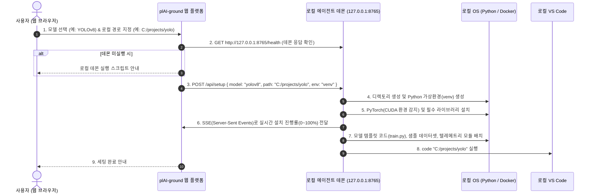

# plAI-ground 멀티 환경 원클릭 세팅 기술 전략 보고서
> **문서 번호:** PLAI-TECH-2026-002  
> **최종 개정일:** 2026년 10월  
> **핵심 주제:** 제로 인프라 연동, 웹-로컬 브릿지(Web-to-Local Bridge) 원클릭 디렉토리 세팅, CLI 및 Google Colab 1줄 연동, 계정 연동 및 무결성 텔레메트리

---

## 1. 기술적 개요: 브라우저 보안 제약과 웹-로컬 연동 방안

### 1.1 사용자 질문에 대한 기술 검토
> **"웹 페이지에서 똑같이 AI 모델을 선택하고 자신의 로컬 컴퓨터 작업 디렉토리 폴더를 설정하면, 그 로컬 디렉토리 폴더에 가상환경 설치와 도커 컨테이너 설치, AI 모델 설치, 예시 학습 코드 및 데이터 설치를 해주는 것이 기술적으로 가능한 작업인가?"**

👉 **기술적으로 구현 가능합니다.**  
다만, 웹 브라우저의 보안 모델(샌드박스 정책)로 인해 순수 웹 프론트엔드 코드(JavaScript)만으로는 사용자의 로컬 OS 명령(`python -m venv`, `docker run` 등)을 직접 실행할 수 없습니다. 따라서 **로컬 에이전트 데몬(Local Agent Daemon)** 또는 **네이티브 브릿지**를 통한 통신 아키텍처를 적용합니다.

### 1.2 브라우저 보안 제약과 극복 메커니즘
- **브라우저 샌드박스(Sandbox)의 제약**:
  - Chrome, Edge 등 일반 웹 브라우저는 보안상 로컬 프로세스를 직접 기동하거나 로컬 시스템 파일에 임의로 바이너리를 실행하는 권한을 엄격히 차단합니다.
- **해결 방안: 로컬 에이전트 데몬 (Web-to-Local Bridge)**:
  - 사용자의 로컬 환경에서 경량 백그라운드 프로세스(`plaiground-daemon`)가 `127.0.0.1:8765` 포트로 대기합니다.
  - 웹 페이지에서 사용자가 모델과 로컬 디렉토리 경로를 선택하고 [세팅 시작]을 누르면, 웹 브라우저가 로컬 데몬(`http://127.0.0.1:8765/api/setup`)으로 설정 데이터를 전송합니다.
  - 로컬 데몬이 OS 권한으로 해당 디렉토리에 폴더 생성, 가상환경 구성, 패키지 설치, 템플릿 코드 배치를 실행하고 완료 후 VS Code를 호출합니다.

---

## 2. 3가지 원클릭 세팅 구현 전략 비교

```
┌─────────────────────────────────────────────────────────────────────────────┐
│                       plAI-ground 세팅 전략 트리                            │
└─────────────────────────────────────────────────────────────────────────────┘
                                  │
         ┌────────────────────────┼────────────────────────┐
         ▼                        ▼                        ▼
[방식 1: CLI 터미널 도구]     [방식 2: Google Colab 1줄]   [방식 3: 웹-로컬 브릿지]
 - pip install plaiground  - !pip install plaiground  - 웹 UI에서 폴더/모델 선택
 - plaiground init         - pg.load_template()       - 로컬 데몬이 venv/도커 구성
 - 전공자/터미널 환경       - 저사양 노트북/무료 GPU  - 웹 기반 비전공자/초심자
```

| 비교 항목 | 방식 1. CLI 터미널 도구 | 방식 2. Google Colab 1줄 연동 | 방식 3. 웹-로컬 브릿지 (웹 UI 선택) |
| :--- | :--- | :--- | :--- |
| **대상 사용자** | 컴퓨터공학 전공생, 현업 엔지니어 | GPU가 없거나 저사양 PC 사용자 | 1학년 학부생, 비전공 부트캠프 교육생 |
| **실행 방식** | `plaiground init resnet` | `!pip install plaiground` | 웹 페이지에서 디렉토리/모델 선택 후 버튼 클릭 |
| **컴퓨팅 자원** | 사용자 로컬 PC (GPU/CPU) | Google 제공 무료 T4/L4 GPU | 사용자 로컬 PC (venv 또는 Docker) |
| **설치 소요 시간** | 30초 내외 | 10초 내외 | 1~2분 (패키지 다운로드 시간에 비례) |
| **플랫폼 인프라 비용**| 0원 (로컬 연산) | 0원 (Google 자원 활용) | 0원 (로컬 연산) |

---

## 3. 세부 방식별 아키텍처 및 구현 명세

### 3.1 방식 3: 웹-로컬 브릿지 (Web-to-Local Bridge)
웹 화면에서 모델과 로컬 디렉토리 경로를 선택하면, 로컬 PC의 해당 경로에 가상환경, 패키지, 모델 템플릿, 학습 코드가 구성되는 방식입니다.

#### 3.1.1 동작 흐름도 (End-to-End Workflow)


#### 3.1.2 로컬 에이전트 데몬 구현 방안
기존에 구현된 `c:\workspace\plaiground\ai_set_demo\api_server.py`의 FastAPI 기반 환경 제어 로직을 로컬 에이전트 데몬으로 적용합니다:

1. **실행 방식**:
   - 윈도우 PowerShell 단일 커맨드 실행 또는 경량 바이너리 실행 파일(`plaiground-agent.exe`)을 백그라운드로 구동.
2. **API 엔드포인트 구성**:
   - `GET /health`: 에이전트 상태 및 하드웨어 정보(NVIDIA GPU, CUDA 사용 가능 여부, Python 버전) 반환.
   - `POST /select-folder`: 브라우저 대신 OS 네이티브 폴더 선택 창을 띄워 사용자가 디렉토리를 지정할 수 있도록 지원.
   - `POST /setup`:
     - 파라미터: `{ "target_dir": "C:/ai_study", "model_id": "resnet50", "environment": "venv" }`
     - 동작: 지정 경로 생성 ➔ `python -m venv .venv` ➔ PyTorch 및 라이브러리 설치 ➔ `train.py` 및 샘플 데이터 배치 ➔ `code <target_dir>` 실행.
   - `GET /setup-progress`: Server-Sent Events(SSE)로 설치 진행 상태를 웹 브라우저에 스트리밍.

---

### 3.2 방식 1: CLI 터미널 도구 (`pip install plaiground`)

터미널 인터페이스를 선호하는 개발자 및 전공자를 위한 표준 배포 방식입니다.

#### 3.2.1 명령어 구성
```bash
# 1. plAI-ground CLI 설치
pip install plaiground

# 2. 계정 인증
plaiground login

# 3. 모델 실습 환경 초기화
plaiground init resnet-cifar10 --dir ./my_first_ai
```

#### 3.2.2 내부 실행 로직
1. **하드웨어 및 런타임 감지**:
   - OS 종류(Windows, Linux, macOS) 및 Python 버전 확인.
   - `nvidia-smi` 또는 `torch.cuda.is_available()`를 통해 CUDA 드라이버 유무 확인 후 적합한 PyTorch 버전 선택.
2. **가상환경 격리**:
   - 대상 디렉토리 내 `.venv` 생성 및 패키지 설치.
3. **학습 코드 및 데이터 배치**:
   - `model.py`, `train.py`, 샘플 데이터셋 디렉토리 배치.
   - 텔레메트리 로깅 모듈 주입:
     ```python
     import plaiground as pg
     tracker = pg.init(project="cifar10-resnet")
     
     # 에포크별 손실 및 정확도 로깅
     tracker.log(epoch=epoch, loss=loss.item(), acc=acc)
     ```
4. **IDE 연동**:
   - 설치 완료 후 `code .` 명령을 통해 VS Code 자동 열기.

---

### 3.3 방식 2: Google Colab 1줄 연동

로컬 GPU가 없거나 사양이 부족한 사용자를 위한 방식입니다.

#### 3.3.1 노트북 셀 구성
```python
# [Cell 1] 라이브러리 설치 및 템플릿 로드
!pip install -q plaiground
import plaiground as pg

pg.auth(token="USER_API_TOKEN")
pg.load_template("diffusion-mnist")
```

```python
# [Cell 2] 학습 실행
!python train.py
```

#### 3.3.2 동작 방식
- Colab 환경 내에 템플릿 코드와 샘플 데이터셋이 자동으로 로드됩니다.
- 학습 진행 중 손실값 및 정확도 데이터가 plAI-ground 웹 플랫폼의 ViewAI 시각화 화면으로 비동기 전송됩니다.
- 학습 종료 시 포트폴리오 생성 링크(`https://plaiground.io/p/verify_...`)가 출력됩니다.

---

## 4. 계정 연동 및 쿼터 관리 아키텍처

```
┌──────────────────────────────────────────────────────────────────┐
│                   plAI-ground Cloud (Supabase)                   │
│  - users (id, email, subscription_tier: free | pro | campus)     │
│  - portfolios (id, user_id, integrity_hash, public_url)          │
│  - usage_credits (user_id, free_credits_remaining: 5 -> 4 -> 0)  │
└──────────────────────────────────┬───────────────────────────────┘
                                   │
                                   ▼
        ┌─────────────────────────────────────────────────────┐
        │                 API Key / JWT 인증                  │
        └──────────────────────────┬──────────────────────────┘
                                   │
          ┌────────────────────────┼────────────────────────┐
          ▼                        ▼                        ▼
    [CLI Agent]            [Google Colab]           [Web Daemon]
```

1. **무료 계정 (Free Tier)**:
   - 원클릭 세팅 기능: 횟수 제한 없이 무료 제공.
   - 포트폴리오 생성: 5회 무료 제공 (Supabase `usage_credits` 테이블에서 차감).
   - 크레딧 소진 시: 추가 포트폴리오 생성을 위한 Pro 플랜 결제 안내 모달 표시.
2. **대학 학과 / KDT 부트캠프 계정**:
   - 기관 라이선스 키 등록 시 소속 학생들에게 무제한 포트폴리오 생성 및 교수 LMS 모니터링 연동 지원.

---

## 5. 코드 무결성 검증 (DiffStack) 구조

1. **코드 변경 이력 기록**:
   - 코드 작성 및 수정 시점의 타임스탬프와 파일 변경 내역을 주기적으로 기록하여 외부 단순 복사와 점진적 코드 수정을 구별할 수 있는 데이터 수집.
2. **실행 및 에러 이력 보존**:
   - 학습 실행 중 발생한 예외(OOM, 차원 불일치 등)와 수정 후 재실행 내역을 기록하여 실제 디버깅 과정 확인.
3. **SHA-256 서명 발급**:
   - 검증된 학습 결과물 및 로그를 기반으로 위변조 방지 해시를 생성하고 포트폴리오 상에 인증 뱃지로 표기.

---

## 6. 개발 단계별 구현 계획
1. **1단계**:
   - CLI 도구(`pip install plaiground`) 패키징 및 템플릿 배포 로직 구현.
   - Google Colab 연동 템플릿 로더 개발.
2. **2단계**:
   - 기존 `ai_set_demo/api_server.py` 로직을 기반으로 로컬 데몬(`127.0.0.1:8765`) 및 웹 브라우저 간 통신 연동.
   - 웹 UI에서 디렉토리 선택 및 설치 진행률 스트리밍 구현.
3. **3단계**:
   - Supabase 기반 5회 무료 쿼터 관리 및 B2C Pro 결제 모달 연동.
